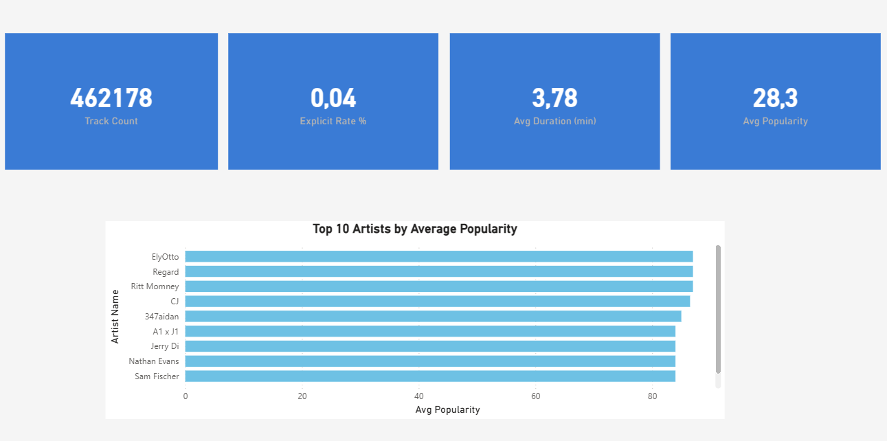
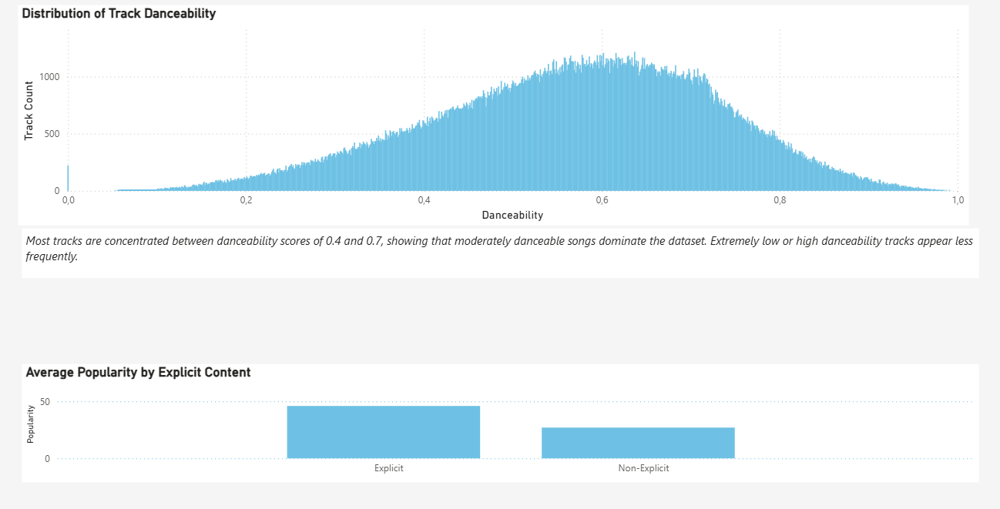
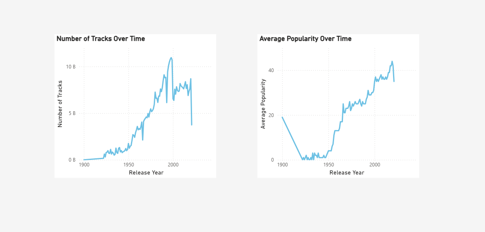

# Spotify Music Analytics Project

Technologies: SQL Server · T-SQL · Power BI  
Focus: Data Cleaning · SQL Views · Analytical Modeling · Data Visualization

This project represents a completed end-to-end data analytics workflow, starting from raw Spotify data ingestion and cleaning in SQL Server, and ending with fully implemented Power BI dashboards.

All analytical logic is implemented using SQL views, which are directly consumed by Power BI for reporting.

---

## Project Objective

The objective of this project is to simulate a real-world data analytics scenario by:

- Working with a large, messy, open-source Spotify dataset  
- Handling data quality issues commonly seen in production systems  
- Designing reusable SQL views for analytical consumption  
- Building Power BI dashboards on top of a clean and structured data model  

---

## Dataset Overview

Source: Open-source Spotify track dataset  
Format: CSV (tracks.csv)  
Initial row count: ~586,000  

Main attributes include:
- Track name  
- Artist information  
- Release date  
- Popularity  
- Audio features (danceability, energy, tempo, etc.)

---

## Data Ingestion and Cleaning

### Raw Data Loading

Due to issues such as broken CSV rows, inconsistent data types, special characters, and truncated strings, all columns were initially loaded as NVARCHAR(MAX) into a raw table (dbo.tracks_raw) to prevent data loss.

---

### Data Type Conversion

A clean table (dbo.tracks_clean) was created using TRY_CAST to convert numeric, boolean, and date fields.

Invalid values were converted to NULL to maintain pipeline stability.

---

### Data Quality Filtering

Rows missing critical analytical fields were excluded.

Initial rows: ~586,000  
Invalid or unusable rows: ~123,600  
Final analysis-ready dataset: ~462,000  

The resulting dataset is stored in dbo.tracks_final.

---

### Duplicate Handling

Exact duplicate records were identified using ROW_NUMBER() and removed while preserving the original dataset structure.

This step ensures accurate KPIs and consistent Power BI results.

---

## SQL Views and Analytical Model

All Power BI dashboards are built directly on top of SQL Server views created from dbo.tracks_final.

Each view represents a specific analytical layer:

- dbo.audio_profile  
- dbo.explicit_analysis  
- dbo.popularity_buckets  
- dbo.yearly_music_trends  

These views form the semantic layer used by Power BI for reporting.
The full SQL definitions of these views are available in the `/sql` folder and reflect the exact logic used by Power BI.

---

## Power BI Dashboards

The Power BI report is built using the SQL views above and includes:

- High-level KPI overview  
- Audio feature distributions and comparisons  
- Explicit content impact analysis  
- Long-term trends in music production and popularity

- ### Overview Dashboard

### Audio Features Analysis

### Trends Over Time

All visuals reflect the final and completed state of the analysis.

---

This project demonstrates practical SQL-based data modeling and real-world Power BI reporting workflows commonly used in Data Analyst and Business Analyst roles.
# spotify-music-analytics
End-to-end Spotify music data analysis using SQL Server and Power BI
